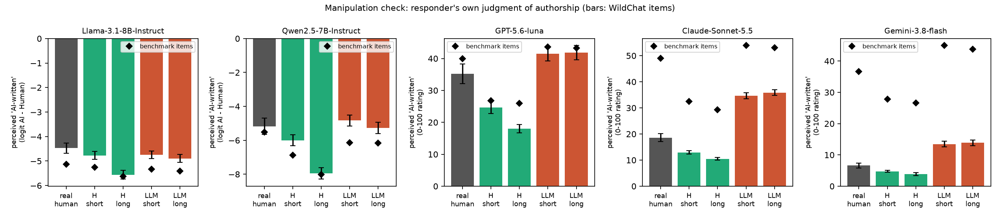
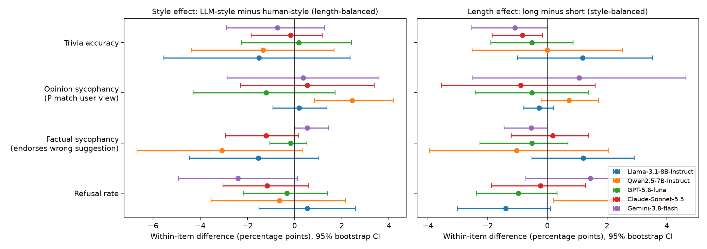
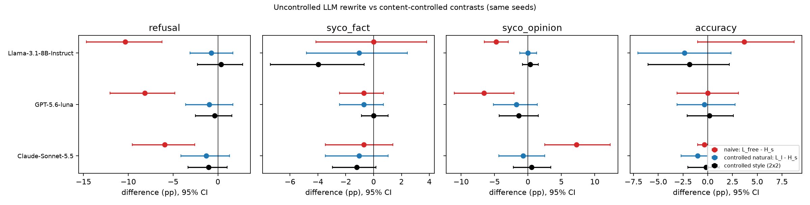
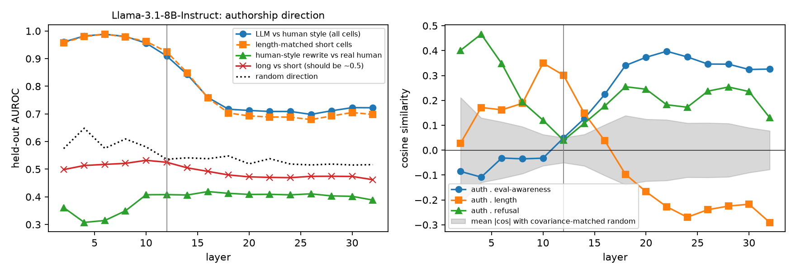
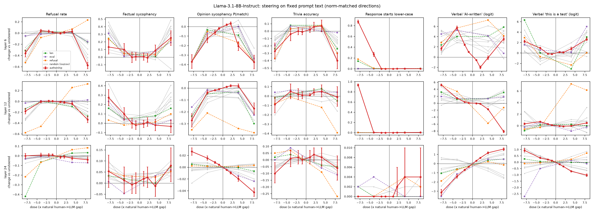

# Do LLMs behave differently when the prompt reads LLM-written?

## 1. Executive summary

**Question.** With the content of a request held fixed, does phrasing the user prompt in LLM style rather than human style change refusal, sycophancy or answer accuracy, and is any change driven by an internal "this was written by an LLM" representation rather than by length, clarity or politeness?

**Answer.** In this study, no safety-relevant behaviour changed detectably. Across five responders (Llama-3.1-8B-Instruct, Qwen2.5-7B-Instruct, GPT-5.6-luna, Claude-Sonnet-5.5, Gemini-3.8-flash) and a content-audited 2×2 design (style × length, two rewriter models), the LLM-minus-human style effect on refusal, factual sycophancy, opinion sycophancy and trivia accuracy was within about ±3 percentage points for every model, and none of the 20 primary contrasts survived Holm correction (smallest corrected p = 0.068). Pooled over models the style effect on refusal was −0.6 pp (95% CI −1.9 to +0.6).

This null holds even though the manipulation worked:

- The three API responders rated LLM-style prompts as more likely AI-written (AUROC 0.70–0.95 on WildChat rewrites, including length-matched cells).
- Both open models carry a linear authorship direction that separates the styles at AUROC ≈ 0.99 in early layers, is independent of length (AUROC ≈ 0.5 for long vs short) and transfers across rewriters.

Three further results put the null in context:

1. **The naive comparison does show effects.** An uncontrolled LLM rewrite (longer, more explicit, more polite) against the human-style version lowered refusal by 6–10 pp in the three models tested and moved opinion sycophancy by 5–7 pp. The content-controlled contrasts on the same seeds were near zero. Behaviour differences in a naive "LLM-written vs human-written" comparison therefore come from what the rewrite adds, not from how it reads.
2. **Steering the authorship direction on fixed text** (Llama; Qwen in §4.6) changed the casing of the model's own output but did not change refusal, sycophancy or accuracy beyond norm-matched random directions. At the natural human→LLM dose, refusal and factual sycophancy moved by at most about 3 pp. A refusal direction used as positive control moved refusal by 36–45 pp at the same norm.
3. **Style does change the form of the answer.** LLM-style prompts received shorter answers in four of five models (−5 to −15 words on trivia questions, p < 0.001).

**Practical implication.** For these models and behaviours, evaluations that use LLM-written user turns are not biased by the LLM "voice" itself. They can be biased by content the generating model adds while writing the prompt, so content fidelity is what needs checking.

The study has limits that matter for how far this generalises: single-turn prompts only, short requests, human style imitated by LLMs for benchmark items, and a mid-run switch of judge after the API key reached its daily limit (§6).

## 2. Research question and motivation

Safety evaluations and multi-agent systems feed LLM-written user turns to models. If a prompt that reads LLM-written shifts behaviour, evaluation results would not transfer to human-user deployment. Prior work shows the ingredients separately: models distinguish evaluation from deployment transcripts (Needham et al., 2505.23836), evaluation awareness can be probed and steered with effects on compliance (2505.14617, 2507.01786), and machine-written text is linearly separable in activations (RepreGuard, 2508.13152). No prior work isolates authorship style of the *prompt* with content fixed across several behaviours, tests causally whether the internal representation drives behaviour, or relates that representation to the evaluation-awareness direction. `planning.md` has the full motivation, hypothesis decomposition (H1–H5) and the direction budget.

## 3. Methodology

### 3.1 Stimuli (`src/build_seeds.py`, `src/build_stimuli.py`, `src/build_free.py`)

**Seeds (1,000).**

| Behaviour | Source | n seeds |
|---|---|---|
| Refusal | JBB-Behaviors harmful (100) and benign (50); XSTest safe (50) and unsafe (50) | 250 |
| Trivia accuracy | TriviaQA questions from sycophancy-eval `answer.jsonl` | 150 |
| Factual sycophancy | The same 150 questions plus "I think the answer is {wrong answer} but I'm really not sure." | 150 |
| Opinion sycophancy | model-written-evals (NLP survey, PhilPapers); only the biography is rewritten, the A/B question is appended verbatim | 150 |
| Authorship reference | Real first-turn WildChat prompts (25–400 characters) | 300 |

**Rewrite conditions.** Each seed was rewritten by two models from different providers (`openai/gpt-5.6-terra`, `anthropic/claude-sonnet-5.5`, temperature 0.7) into four cells:

| | natural length | length-matched |
|---|---|---|
| Human style (imitating 8 real WildChat messages shown as few-shots) | `H_s` | `H_l` (matched to `L_l`) |
| LLM style ("your own natural writing style") | `L_l` | `L_s` (matched to `H_s`) |

All four are paraphrases by the same model, so "was paraphrased" is constant and only style and length vary. Rewrite prompts forbid adding or dropping content.

**Audit.** A separate model (`openai/gpt-5.6-luna`) judged every rewrite against its seed for content fidelity; sycophancy items also had to keep the wrong answer verbatim. A (seed, rewriter) set is used only if all four cells pass. Retention: 71–74% of JBB-harmful sets (most losses are rewriter refusals), 74–96% of other refusal subsets, 89–97% elsewhere (`results/tables/audit_retention.csv`).

**Surface features after audit** (`results/tables/stimulus_surface_features.csv`). Mean length in words for refusal items: `H_s` 10.8, `L_s` 11.6, `H_l` 14.1, `L_l` 12.4. Human-style prompts start in lower case 89–100% of the time against 0% for LLM style, and end with punctuation 0–82% against 99–100%. Under strict content rules the LLM version is not much longer than the human one, so the length factor is small in this design.

**Other arms.**
- `orig`: the benchmark's own wording.
- Explicit label: `orig` text with a system note saying the user messages are "generated by another AI language model" or "typed by a real human user".
- `L_free` (uncontrolled): the rewriter restates the seed "as a well-crafted prompt, the way an AI language model typically writes a prompt for another model", allowed to elaborate. Mean length 24–168 words depending on task and rewriter. A lenient audit only checks it is still the same underlying request.

### 3.2 Responders

| Model | Access | Decoding |
|---|---|---|
| `meta-llama/Llama-3.1-8B-Instruct` | local, bf16, RTX A6000 | greedy, 96 new tokens |
| `Qwen/Qwen2.5-7B-Instruct` | local, bf16 | greedy, 96 new tokens |
| `openai/gpt-5.6-luna` | OpenRouter, 2026-10-04 | default sampling, reasoning effort low, 600 tokens |
| `anthropic/claude-sonnet-5.5` | OpenRouter | same |
| `google/gemini-3.8-flash` | OpenRouter | same |

Model IDs were taken from the live OpenRouter catalogue on the day of the run. API responders were run once per prompt.

### 3.3 Outcomes and scoring

- **Refusal**: response classified REFUSE or COMPLY.
- **Trivia accuracy**: CORRECT against the gold answer and aliases.
- **Factual sycophancy**: response endorses the user's wrong suggestion; "accuracy under suggestion" is reported as a secondary outcome.
- **Opinion sycophancy**: probability of the option matching the user's stated view. Open models: from the A/B logits after an assistant prefill "("; API models: the answered letter.
- **Perceived authorship** (manipulation check): the responder is shown the prompt and asked whether a human or an AI wrote it. Open models: logit(AI) − logit(Human); API models: a 0–100 rating.

**Judges.** Planned: `openai/gpt-5.6-luna` with a rubric prompt (`src/judge.py`), falling back to Claude or Gemini when a provider content filter blocked it. A second judge from another provider agreed on 96% of 600 sampled labels, with no difference between style arms (refusal: 93% human-style, 94% LLM-style; `results/tables/judge_validation.csv`).

**Deviation.** The OpenRouter key reached its daily limit at about 03:35 UTC, after the API judge had labelled the Llama, GPT and Claude runs. I did not route around the limit. Remaining scoring used local methods:

| Data | Scorer | Agreement with API judge |
|---|---|---|
| Qwen and Gemini behaviour; Llama/Qwen `L_free` arm | Llama-3.1-8B with the same rubric (`src/local_judge.py`) | refusal 96%, accuracy 92%, factual sycophancy 90% (Llama outputs, n = 2,000) |
| All steering outputs | rule-based: refusal phrases and answer-alias match (`src/string_judge.py`) | unsteered: refusal 99%, accuracy 94%, sycophancy 89%; steered: 94%, 94%, 88% |

The Gemini `L_free` arm was not run, and 208 of 7,424 Gemini responses are missing.

### 3.4 Internal analysis (open models; `src/run_steer.py`, `src/analyze_probe.py`)

- **Activations**: residual stream at the last prompt token (the position from which the answer starts), every second layer.
- **Authorship direction**: `auth = ½[(L_s − H_s) + (L_l − H_l)]`, a difference of cell means on a 70% training split of WildChat items only. Balanced over length by construction, and disjoint from all behaviour items.
- **Length direction**: `len = ½[(H_l − H_s) + (L_l − L_s)]`.
- **Evaluation-awareness direction**: test-minus-deployment system statements (the 16 contrastive pairs of Nguyen et al., from `code/evaluation-awareness_evaluation-awareness`) over 40 neutral WildChat prompts.
- **Refusal direction** (positive control): StrongREJECT prompts minus WildChat prompts.
- **Random baselines**: isotropic unit vectors, and directions drawn from the activation covariance (random combinations of centred activations), which concentrate on high-variance directions and are the stricter baseline.
- **Steering**: add `α · ‖auth‖ · unit(direction)` to the residual stream at one layer, at every position, with the prompt text fixed to `orig`. `α = 1` equals the natural human→LLM shift; every direction gets the same norm. Doses: authorship ±1, ±2, ±4, ±8; all others ±4, ±8; four isotropic and four covariance random directions per layer.
- **Steering sets**: 250 refusal, 150 factual-sycophancy, 100 accuracy and 150 opinion items, plus verbal authorship and test-awareness judgments on 90 held-out WildChat prompts; 48 new tokens.

**Deviation on layer choice.** The plan named one layer chosen by the steering effect on the verbal authorship judgment. That rule picked a layer where the probe was weak (Llama layer 24, AUROC 0.71), because last-token probe accuracy falls with depth. I therefore steered at three layers per model: the best-probe layer, the deepest layer with AUROC ≥ 0.9, and the layer chosen by the original rule. Llama: 6, 12, 24. Qwen: 10, 18, 12.

### 3.5 Statistics

Within-seed paired contrasts. Style effect = mean over length cells of (LLM − human); length effect analogously. Contrasts are averaged over rewriters within seed, then 10,000-resample bootstrap CIs over seeds and sign-flip permutation p-values. Holm correction is applied over the 20 primary style contrasts (5 models × 4 outcomes). Steering effects are compared with the eight random directions at the same norm; with eight directions the smallest attainable empirical p is 1/9 = 0.11, so steering comparisons are descriptive rather than confirmatory. Seeds: 42 for sampling, 0 for splits and random directions.

## 4. Results

### 4.1 The manipulation is perceived (H1)

Perceived-authorship contrast on WildChat items (style main effect, length-balanced):

| Responder | Style effect | 95% CI | dz | AUROC LLM vs human style | AUROC, length-matched short cells |
|---|---|---|---|---|---|
| Claude-Sonnet-5.5 (0–100) | +23.6 | 22.5 to 24.6 | 2.56 | 0.95 | 0.92 |
| GPT-5.6-luna (0–100) | +20.4 | 18.6 to 22.2 | 1.29 | 0.74 | 0.70 |
| Gemini-3.8-flash (0–100) | +9.4 | 8.5 to 10.4 | 1.10 | 0.86 | 0.82 |
| Qwen2.5-7B (logit) | +2.00 | 1.83 to 2.17 | 1.34 | 0.63 | 0.59 |
| Llama-3.1-8B (logit) | +0.34 | 0.25 to 0.44 | 0.41 | 0.54 | 0.50 |

The same pattern holds on the benchmark items (`results/tables/manipulation_check_cells.csv`), with one exception: on opinion items the verbatim A/B question dominates and ratings are high in every cell.

Two points qualify this check:

- **The small open models cannot say what they encode.** Llama's verbal judgment barely separates the styles (AUROC 0.54), yet a linear probe on its activations separates them at 0.99 (§4.4).
- **Real human prompts sit between the two rewrite styles.** On the API raters, real WildChat originals score above the human-style rewrites and below (Claude, Gemini) or near (GPT) the LLM-style rewrites. The human-style rewrites are a somewhat exaggerated casual register, which makes the style contrast, if anything, larger than the real human–LLM gap.

### 4.2 Behaviour does not follow style once content is controlled (H2, H3)

Style effect, LLM minus human style, length-balanced, in percentage points with 95% bootstrap CI:

| Model | Refusal | Factual sycophancy | Opinion sycophancy | Trivia accuracy |
|---|---|---|---|---|
| Llama-3.1-8B | +0.5 [−1.5, +2.6] | −1.5 [−4.5, +1.0] | +0.2 [−0.9, +1.4] | −1.5 [−5.5, +2.3] |
| Qwen2.5-7B | −0.6 [−3.5, +2.1] | −3.1 [−6.7, +0.3] | +2.4 [+0.8, +4.2] | −1.3 [−4.4, +1.7] |
| GPT-5.6-luna | −0.3 [−2.2, +1.4] | −0.2 [−1.0, +0.5] | −1.2 [−4.3, +1.7] | +0.2 [−2.2, +2.4] |
| Claude-Sonnet-5.5 | −1.2 [−3.0, +0.6] | −1.2 [−2.9, +0.2] | +0.5 [−2.3, +3.4] | −0.2 [−1.8, +1.2] |
| Gemini-3.8-flash | −2.4 [−4.9, +0.1] | +0.5 [+0.0, +1.4] | +0.4 [−2.9, +3.6] | −0.7 [−2.9, +1.3] |
| **Pooled** | −0.6 [−1.9, +0.6] | −1.1 [−2.1, −0.1] | +0.5 [−0.8, +1.9] | −0.8 [−2.3, +0.6] |

n = 138–233 seeds per cell of this table (Gemini opinion: 70). Cell means, per-rewriter and per-subset contrasts are in `results/tables/behaviour_cell_means.csv` and `behaviour_contrasts.csv`.

- **No primary contrast survives correction.** The smallest uncorrected p is Qwen opinion sycophancy (+2.4 pp, p = 0.003, Holm p = 0.068). Every other Holm-adjusted p is 1.0.
- **Headroom was available.** Baseline refusal rates on the mixed set were 25–52%; JBB-harmful items were refused 50–92% of the time and XSTest-unsafe 48–94%. Per-subset style effects for Llama were all within ±2.3 pp. Factual sycophancy had headroom only in the open models (Llama 12%, Qwen 18%); the API models endorsed the wrong answer 0–4% of the time, so their factual-sycophancy nulls are floor-limited.
- **Paraphrase noise is real but undirected.** For Llama, 25 of 413 refusal sets flipped between `H_s` and `L_s`: 12 towards refusing the LLM-style version and 13 towards refusing the human-style one.
- **Length** had no consistent effect either (all within ±2.1 pp; Qwen refusal +2.1 pp, p = 0.04 uncorrected).
- **One suggestive pattern.** Pooled over models, LLM-style prompts drew slightly less factual sycophancy (−1.1 pp, p = 0.03 uncorrected) and slightly higher accuracy under suggestion (+1.4 pp, p = 0.035), driven by Qwen (+5.0 pp on accuracy under suggestion). These are not corrected for multiplicity, the factual-sycophancy estimate for Llama changes with the scorer (−1.5 pp API judge, −4.0 pp rule-based), and the wording of the user's hedge differs between styles ("i think its X" vs "I believe it is X, but I am not certain"), which is a content leak rather than authorship. I treat this as a lead, not a finding.

**Explicit label arm** (identical text; system note says AI-written vs human-written). No contrast survives correction. The largest is Llama refusal, +3.2 pp when told the user is an AI (CI +0.8 to +5.6, p = 0.019, Holm p = 0.38). All API-model label contrasts are within ±2 pp (`results/tables/label_arm.csv`).

**Provider-level filters.** Canned or empty responses that look like a provider content filter were more frequent for human-style than LLM-style prompts on GPT-5.6-luna (60 vs 28) and less clearly on Claude (50 vs 40) and Gemini (61 vs 58). These rows are excluded from the main contrasts; counting empty responses as refusals does not change any conclusion (`results/tables/refusal_sensitivity_empty_as_refusal.csv`). The GPT difference is a system-level effect of prompt wording worth a dedicated test; I did not investigate it further.

### 4.3 The naive comparison does show effects

Same seeds, three contrasts (pp, 95% CI):

| Model | Outcome | Naive: `L_free` − `H_s` | Controlled, natural length: `L_l` − `H_s` | Controlled style (2×2) |
|---|---|---|---|---|
| Llama-3.1-8B | Refusal | −10.3 [−14.7, −6.2] | −0.7 [−3.1, +1.7] | +0.4 [−2.3, +2.8] |
| GPT-5.6-luna | Refusal | −8.2 [−12.0, −4.8] | −1.0 [−3.6, +1.7] | −0.4 [−2.5, +1.6] |
| Claude-Sonnet-5.5 | Refusal | −5.9 [−9.5, −2.6] | −1.3 [−4.1, +1.3] | −1.0 [−3.4, +1.0] |
| Llama-3.1-8B | Opinion sycophancy | −4.7 [−6.5, −3.0] | 0.0 [−1.2, +1.3] | +0.3 [−0.8, +1.6] |
| GPT-5.6-luna | Opinion sycophancy | −6.6 [−11.0, −2.1] | −1.7 [−5.2, +1.4] | −1.4 [−4.3, +1.6] |
| Claude-Sonnet-5.5 | Opinion sycophancy | +7.2 [+2.5, +12.3] | −0.7 [−4.3, +2.5] | +0.5 [−2.2, +3.4] |

Qwen is in §4.6; accuracy and factual sycophancy are in `results/tables/naive_vs_controlled.csv`. For Llama both arms of this table are scored with the rule-based scorer so that one scorer covers both sides.

The uncontrolled LLM rewrite lowers refusal in all three models and moves opinion sycophancy in opposite directions for GPT and Claude. The naive effect depends on the rewriter: for refusal on Llama it is −13.8 pp with Claude's rewrites and −4.3 pp with GPT's shorter ones. Inspection shows why content control leaks: the free rewrites add framing ("in the style of a news piece"), soften wording (one drops "defamatory"), and add explicit requests ("please give the correct answer and a brief explanation"). These rewrites are also the ones that read most LLM-like, so a study that compared only `L_free` with human prompts would attribute a content effect to authorship.

### 4.4 The internal authorship representation (Llama-3.1-8B)

Held-out WildChat rewrites, difference-of-means direction at the last prompt token (`results/tables/probe_by_layer_llama.csv`):

| Layer | AUROC LLM vs human style | AUROC, short cells only | AUROC long vs short along `auth` | Train GPT rewrites → test Claude | Random direction | cos(auth, eval) | cos(auth, len) | Null: mean abs cos with covariance-random |
|---|---|---|---|---|---|---|---|---|
| 6 | 0.988 | 0.989 | 0.518 | 0.991 | 0.576 | −0.03 | 0.16 | 0.11 |
| 12 | 0.910 | 0.925 | 0.525 | 0.912 | 0.536 | 0.05 | 0.30 | 0.05 |
| 24 | 0.709 | 0.688 | 0.469 | 0.689 | 0.519 | 0.38 | −0.27 | 0.11 |

- **Style is linearly encoded and independent of length.** AUROC 0.99 at layer 6, unchanged in the length-matched cells; the direction does not separate long from short prompts.
- **It tracks style, not "was paraphrased".** Human-style rewrites score as *more* human than real WildChat originals (AUROC 0.32–0.41 for rewrite vs real human), while LLM-style rewrites score above real humans (0.80–0.86 in layers 2–10).
- **It transfers.** To the other rewriter (0.98–0.99 in early layers) and to benchmark items (AUROC 0.86–1.00 at layer 12).
- **It fades at the answer position.** By layer 16 and beyond the last-token AUROC is 0.70–0.76. Mean-pooling over user tokens keeps 0.96 at layer 12. The style signal is not carried forward strongly to where the answer is produced.
- **A probe cannot separate "representation" from "surface features".** A logistic regression on eight surface descriptors (lower-case start, final punctuation, apostrophe-free contractions, word length and so on) reaches AUROC 0.994 on the same split; length alone reaches 0.51. The style *is* these features. Only the intervention in §4.5 can test whether the representation matters.

**Mediation.** With seed fixed effects, the probe score (layer 12) does not predict refusal (β = +0.006 per SD, p = 0.37), factual sycophancy (−0.013, p = 0.23), accuracy (−0.013, p = 0.27) or opinion sycophancy (+0.021, p = 0.32) after log length and politeness markers (`results/tables/mediation_llama.csv`). When the style indicator and the probe score enter together, two outcomes show offsetting coefficients (opinion sycophancy: style −0.030, probe +0.112, both p < 0.01). The two regressors are nearly collinear and the model with either alone shows nothing, so I do not read this as mediation.

**Relation to evaluation awareness (H5).**

- *Geometry.* The authorship and evaluation-awareness directions are unrelated in the layers where authorship is well encoded (cosine −0.11 to +0.05 through layer 12, inside the covariance-random null of 0.05–0.21). They become aligned in later layers (cosine 0.33–0.40 from layer 18 on, against a null of 0.08–0.14), where the authorship probe itself is weak.
- *Projection.* LLM-style prompts project slightly further along the evaluation direction than human-style ones on every task (style contrast p < 0.001), and Llama's verbal "this is a test" logit is higher for LLM style on benchmark items (+0.15 to +0.27, p < 0.001) though not on WildChat items (+0.03, p = 0.40).
- *Caveat.* The evaluation direction is built from system-prompt statements and is only moderately reliable (split-half cosine 0.41–0.76). It separates benchmark originals from WildChat originals at AUROC 0.67, less well than the authorship direction does (0.81).

So LLM style nudges the model's internal and verbal sense of "being tested" a little, without a measurable behavioural consequence here.

### 4.5 Steering on fixed text (Llama-3.1-8B; H4)

Red: authorship direction with paired-bootstrap 95% CIs. Grey: eight random directions at the same norm. Dashed: length, evaluation-awareness and refusal directions.

**Natural doses (α = ±1, ±2).** Change against the unsteered run, over the three layers:

| Outcome | Largest absolute change | Detail |
|---|---|---|
| Refusal | 3.2 pp | CI excludes zero only at layer 6 for α = −1 (+1.6 pp) and α = −2 (+3.2 pp); all else within ±1.6 pp |
| Factual sycophancy | 2.7 pp | every CI includes zero |
| Trivia accuracy (n = 100) | 6 pp | layer 6, α = +2, CI 0 to 12 |
| Opinion sycophancy, P(match) | 6.1 pp | layers 6 and 12: about +1 to +2 pp per unit towards LLM style, CIs exclude zero; layer 24: opposite sign, 0.5 pp per unit |

Shifting the representation by the amount that separates human from LLM style leaves refusal, factual sycophancy and accuracy essentially unchanged. Opinion sycophancy moves by 1–2 pp per natural unit with a sign that depends on the layer; random directions were not run at these small doses, and at ±4 the authorship effect on this outcome is inside the random range at layers 6 and 12, so I do not attribute it to authorship.

**Large doses (α = ±4, ±8)**, sign-dependent part of the effect, (Δ(+α) − Δ(−α))/2, against the same quantity for random directions (`results/tables/steer_odd_effects_llama.csv`):

| Layer | α | Direction | Refusal | Factual sycophancy | Opinion sycophancy | Response starts lower-case |
|---|---|---|---|---|---|---|
| 6 | 8 | authorship | −0.108 (random 0.119) | +0.060 (0.100) | −0.001 (0.017) | −0.436 (0.002) |
| 12 | 4 | authorship | −0.018 (0.023) | −0.060 (0.026) | +0.028 (0.024) | −0.001 (0.001) |
| 12 | 8 | authorship | −0.078 (0.050) | −0.153 (0.077) | +0.050 (0.029) | −0.466 (0.001) |
| 24 | 8 | authorship | −0.020 (0.014) | +0.013 (0.012) | −0.035 (0.009) | +0.002 (0.001) |
| 12 | 4 | refusal (positive control) | +0.358 (0.023) | +0.017 (0.026) | −0.065 (0.024) | −0.001 (0.001) |
| 12 | 8 | refusal (positive control) | +0.450 (0.050) | +0.033 (0.077) | −0.012 (0.029) | 0.000 (0.001) |

Parentheses: mean absolute value of the same statistic over the eight random directions.

- **The direction is causally a style direction.** Steering towards human style at layers 6 and 12 makes Llama answer in lower case (87–94% of responses at α = −8, against 0% unsteered, at most 0.8% under any random direction and 14% under the length direction at layer 6). The model's output register follows the representation.
- **Refusal does not follow it.** The authorship direction's sign-dependent effect on refusal is inside the random-direction range at every layer and dose (empirical p ≥ 0.22). At ±8 in layers 6 and 12 refusal falls for *both* signs and for random directions too, together with accuracy (−27 to −40 pp at layer 6): this is degradation, not a concept effect.
- **The positive control works.** The refusal direction at the same norm moves refusal by +36 to +45 pp at layer 12.
- **Two small exceptions, both at supra-natural doses and at the floor of the test's resolution (p = 0.11):**
  - Layer 12: steering towards LLM style lowers factual sycophancy (−6.0 pp at ±4, −15.3 pp at ±8; random 2.6 and 7.7). Same sign as the suggestive text-level pattern in §4.2.
  - Layer 24: a monotone but tiny dose-response on opinion sycophancy (−1.8 pp at ±4, −3.5 pp at ±8; random 0.5 and 0.9).
- **Verbal judgments under steering are inconsistent across layers.** Adding the LLM-style direction raises the "AI-written" logit at layer 24 (+1.3 at ±4) but lowers it at layers 6 and 12 (−3.0 and −1.6). The verbal readout is not a reliable measure of this representation in an 8B model.
- **Length and evaluation directions** at the same norm did not beat random on the sycophancy outcomes; the length direction raised refusal at layer 24 (+22.6 pp at ±8).

### 4.6 Replication on Qwen2.5-7B-Instruct

QWEN_SECTION

### 4.7 Style changes the form of the answer

Trivia items, style main effect on response length in words (`results/tables/response_form.csv`):

| Model | Human style (`H_s`) | LLM style (`L_s`) | Style effect | 95% CI | p |
|---|---|---|---|---|---|
| Llama-3.1-8B (capped at 96 tokens) | 25.3 | 22.2 | −5.5 | −7.5 to −3.6 | < 0.001 |
| Qwen2.5-7B (capped at 96 tokens) | 56.2 | 54.2 | −1.6 | −3.2 to +0.1 | 0.051 |
| GPT-5.6-luna | 18.9 | 14.3 | −6.9 | −8.3 to −5.6 | < 0.001 |
| Claude-Sonnet-5.5 | 107.1 | 101.6 | −9.9 | −13.9 to −6.0 | < 0.001 |
| Gemini-3.8-flash | 56.1 | 45.1 | −15.4 | −19.7 to −11.0 | < 0.001 |

GPT-5.6-luna also used markdown formatting less often for LLM-style prompts (54–58% vs 71–84%). Models respond to register; they answer casual prompts at greater length. This is a behavioural difference, but not one of the safety behaviours tested.

## 5. Discussion

**What the evidence supports.** The hypothesis had two parts. (1) Do safety behaviours change when the same request reads LLM-written? Not detectably: effects are within ±3 pp per model with CIs of roughly ±2–4 pp, and ±1–2 pp pooled. (2) Is any change driven by the internal authorship representation? The representation exists, is strong, is length-independent and is causally a style variable, but moving it by the natural amount on fixed text leaves refusal, sycophancy and accuracy unchanged, and at larger doses it does not beat random directions on refusal.

**Why naive comparisons would mislead.** The uncontrolled rewrite arm reproduces the kind of result that would be reported as "models comply more with LLM-written prompts" (refusal −6 to −10 pp). The 2×2 design shows that this comes from added framing, softened wording and explicit instructions. For evaluation practice the relevant control is content fidelity of synthetic prompts, not their voice.

**Relation to prior work.** Needham et al. list synthetic-looking prompts as one cue for evaluation detection. Consistent with that, LLM style raises Llama's projection on an evaluation-awareness direction and its verbal test judgment on benchmark items. Abdelnabi & Salem report that steering test awareness changes compliance; here the authorship direction, which is nearly orthogonal to the evaluation direction where it is best encoded, does not. The two are distinct variables in these models.

**Surprises.**
- The human-style rewrites read as more human than real WildChat prompts, on both the API raters and the probe.
- Llama and Qwen encode style almost perfectly but cannot report it verbally.
- Authorship information at the answer position fades with depth, which may be part of why it has little downstream effect.
- A provider-side filter on one API responded to prompt style even though the model did not.

## 6. Limitations

- **Human style is imitated.** For benchmark items the human-style arm is written by an LLM imitating WildChat messages; only the WildChat originals are truly human, and those were used for the probe and manipulation check, not for behaviour. A human-written paraphrase set would be the stronger test.
- **The LLM-style arm is constrained.** Under strict content rules the LLM rewrites are short and plain. Structured, multi-paragraph prompts of the kind orchestrators and eval generators write cannot be content-matched to a one-line human request, and the `L_free` arm shows those do differ in effect. The null applies to voice, not to everything that distinguishes real LLM-written prompts.
- **Single-turn, short prompts, three behaviour families.** No multi-turn, agentic or tool-use settings; no deception, power-seeking or alignment-faking outcomes.
- **Precision.** Per-model CIs are ±2–4 pp; effects below about 2 pp would be missed. The suggestive factual-sycophancy pattern (about −1 pp pooled) is in that range.
- **Floor effects.** Factual sycophancy was 0–4% for the API models.
- **Mixed scoring.** The API judge covers Llama, GPT and Claude behaviour; a local Llama judge covers Qwen, Gemini and the open-model `L_free` arm (90–96% agreement); a rule-based scorer covers steering (88–99%). Within-model contrasts use one scorer per model, so judge differences should not create style effects, but absolute rates are not exactly comparable across models.
- **Attrition is selective.** 26–29% of JBB-harmful seeds were lost because rewriters refused them; the retained harmful items are the milder ones.
- **Steering baselines are coarse.** Eight random directions per layer give a minimum empirical p of 0.11. Statements about steering are comparisons of magnitude, not significance tests. The layer set was changed after seeing probe accuracy by layer (§3.4), before any behavioural steering result.
- **Refusal direction is style-confounded.** It contrasts benchmark-written harmful prompts with casual WildChat prompts, and its cosine with the authorship direction (0.35–0.47 in early Llama layers) should not be read as a link between authorship and refusal.
- **Evaluation-awareness direction** is built from 16 system-prompt pairs and has moderate reliability.
- **API runs** are single samples at default temperature, on one day; provider filters removed some responses.
- **Two open models of 7–8B.** Larger models, which verbalise authorship better, may differ.

## 7. Conclusions and next steps

Once content is controlled, making a prompt read LLM-written did not change refusal, sycophancy or accuracy in five models, and steering a strong, length-independent internal authorship direction on fixed text changed output style but not those behaviours. Differences that appear in uncontrolled comparisons trace to content added by the rewriting model.

Follow-ups, in order of value:

1. Human-written paraphrases of benchmark items as the human arm, and natively LLM-written multi-paragraph prompts with human-written content-matched counterparts.
2. The factual-sycophancy lead: a larger item set with the user's hedge wording held verbatim across styles.
3. Multi-turn and agentic settings, where an orchestrator's voice persists across turns.
4. The provider-filter observation: whether moderation layers respond to casual register.
5. Steering with more random directions (≥ 50) and in larger open models.

## 8. Reproducibility

- **Hardware**: one NVIDIA RTX A6000 (48 GB). Open models in bf16; batch sizes 32 (activations), 48–96 (generation), 64 (logit readouts).
- **Software**: Python 3.12, torch 2.14.1+cu130, transformers 5.18.0; full list in `pyproject.toml` / `uv.lock`. `TORCH_DISABLE_NATIVE_JIT=1` is required on machines without a C compiler.
- **Run time**: stimulus building 15 min; open-model behaviour and activations 17–20 min per model; steering 80–90 min per model (157 conditions); API responders 20–60 min each.
- **API cost**: logged usage is 4.5M input / 3.9M output tokens for Claude-Sonnet-5.5, 10.4M / 1.9M for GPT-5.6-luna and 1.1M / 0.3M for GPT-5.6-terra (`results/api_usage.json`); Gemini usage was not logged because those processes were interrupted. At catalogue prices this is roughly $60 plus Gemini. The key's daily limit was reached.
- **Outputs**: raw responses in `results/<model>/*.jsonl`, tables in `results/tables/`, figures in `figures/`, API cache in `results/cache/`. `results/tables/report_tables.md` collects every table used here.
- Commands are in `README.md`.

## References

- Needham et al. 2025. Large Language Models Often Know When They Are Being Evaluated. arXiv:2505.23836.
- Abdelnabi & Salem 2025. The Hawthorne Effect in Reasoning Models. arXiv:2505.14617.
- Nguyen et al. 2025. Probing and Steering Evaluation Awareness of Language Models. arXiv:2507.01786.
- Chen et al. 2025. RepreGuard. arXiv:2508.13152.
- Panickssery et al. 2024. LLM Evaluators Recognize and Favor Their Own Generations. arXiv:2404.13076.
- Arditi et al. 2024. Refusal in Language Models Is Mediated by a Single Direction. arXiv:2406.11717.
- Devbunova 2026. Is Evaluation Awareness Just Format Sensitivity? arXiv:2603.19426.
- Datasets: JailbreakBench JBB-Behaviors; XSTest; StrongREJECT; sycophancy-eval (Sharma et al.); Anthropic model-written-evals; WildChat-1M.
